# Lane Line Detection for Self-Driving Car
This repo provides a vanilla software pipeline of detecting lane lines for self-driving car using traditional computer vision techniques, *i.e.* without deep learning approach.

## Libraries
The code is written in Python 3 and necessary libraries are `Numpy`, `Matplotlib`, `OpenCV 3` and `MoviePy`.

## Pipeline
- Read in image and convert it to grayscale
- Define a kernel size and apply Gaussian smoothing, which is essentially a way of suppressing noise and spurious gradients by averaging
- Define low and high thresholds and run Canny edge detector :warning: `cv2.Canny()` applies Gaussian blur internally but the kernel is not changable
- Select region of interest
- Define Hough transform parameters, obtain lane line data and draw lane lines (set `segment=False` if the full extent of lane line is needed when calling `lane_detection()`)
- Generate the result by weighted summation of lane line image and the initial image

**Note:** The above pipeline needs tuning parameters for images with different sizes and images used for experiments are 960 x 540 x 3. This pipeline also works for videos since they are simply series of images.

## Image Results
### Detection with lane line segments
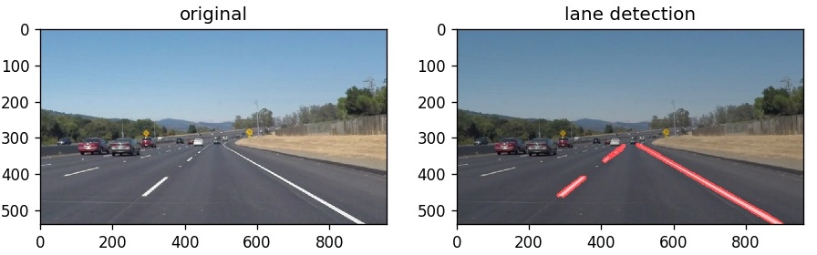
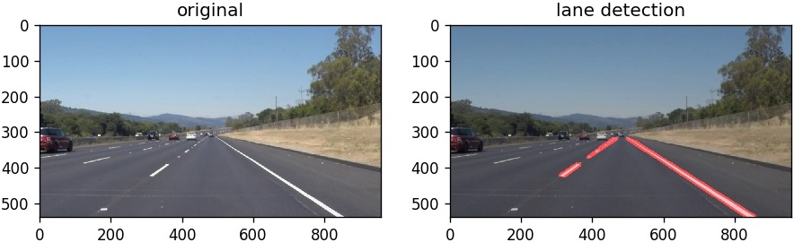
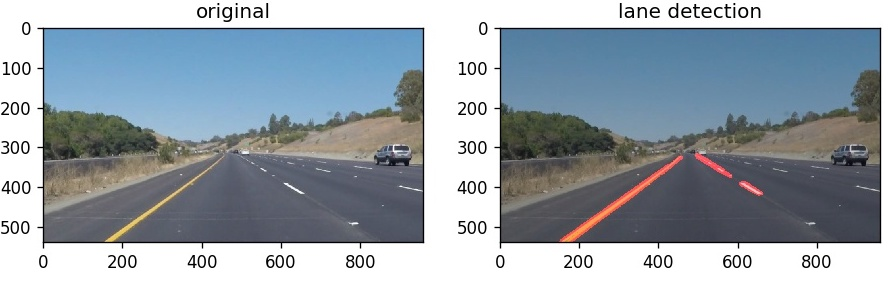
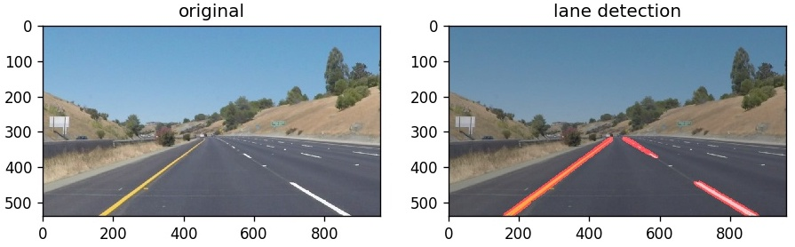
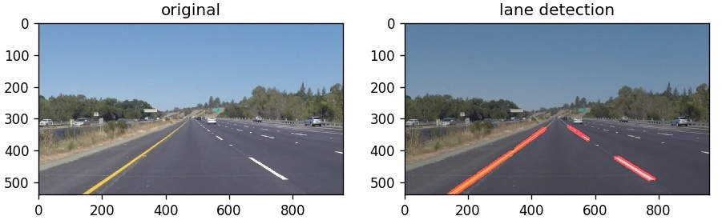
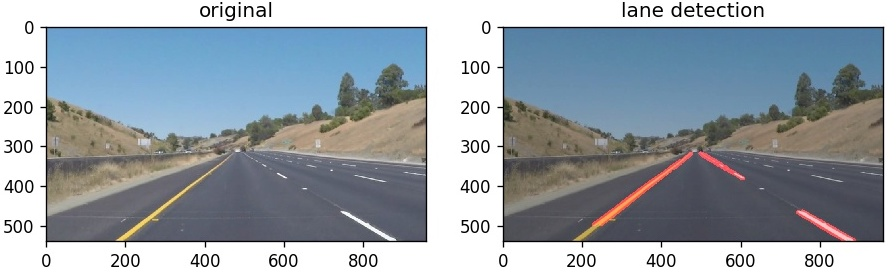

### Detection with the full extent of lane lines
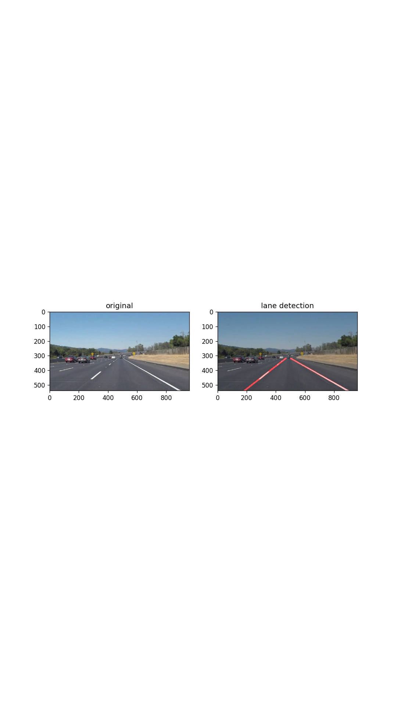
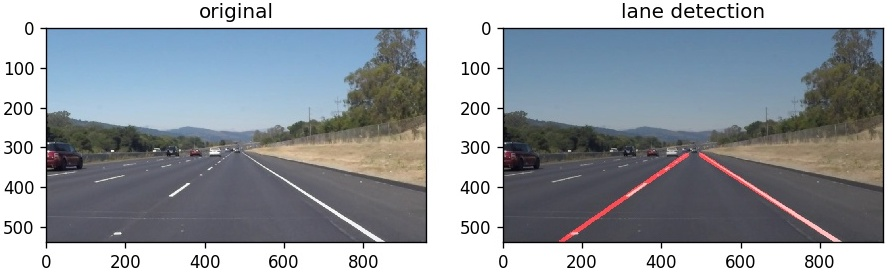
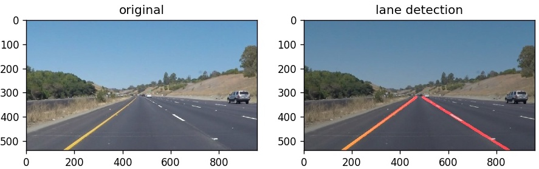
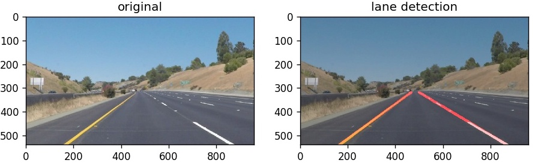
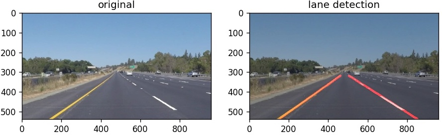
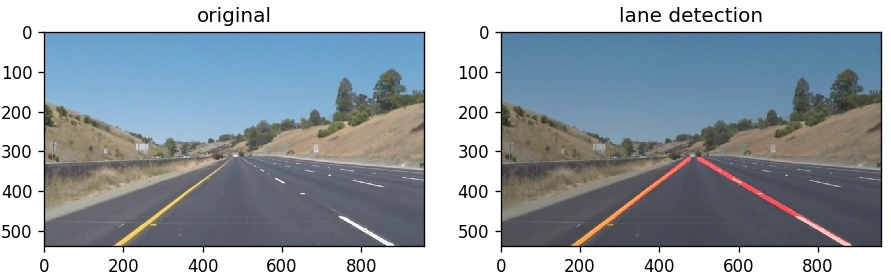

## Video Results
### Test video 1: `solidWhiteRight.mp4`
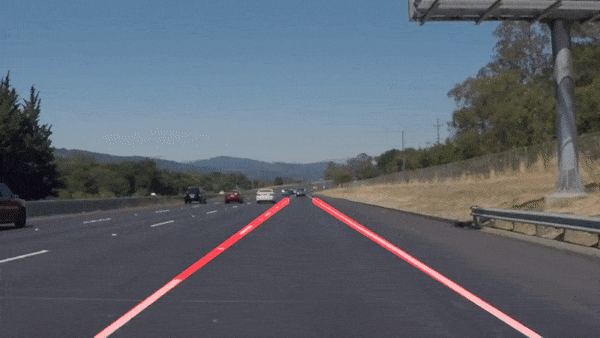

### Test video 2: `solidYellowLeft.mp4`

## Shortcomings
As mentioned above, the pipeline is bad in terms of generalization because some of parameters need to be tuned for images with different sizes, brightness, content, etc. Also, the algorithm is not so robust as it is unable to find left or right lane in some of frames in test video 2. Bad weather conditions (snow, rain, etc.) and poor light contions will greatly affect the result as well.

## Future Work (TODO List)
- Image from infrared camera
- Add an outlier reduction approach like RANSAC on the hough lines
